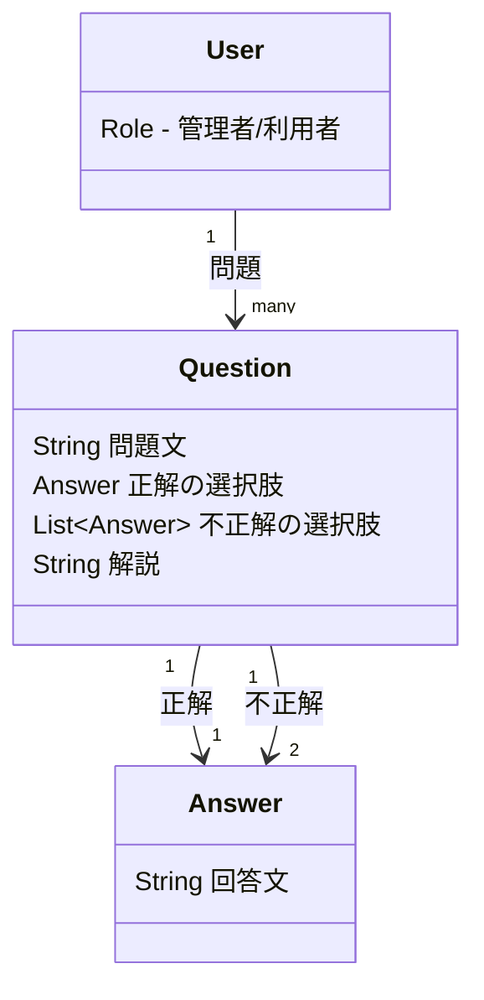

# ドメインモデル

## クラス図

```mermaid
classDiagram
  class User {
    Role - 管理者/利用者
  }

  User "1" --> "many" Question : 問題

  class Question {
    String 問題文
    Answer 正解の選択肢
    List~Answer~ 不正解の選択肢
    String 解説
  }

  Question "1" --> "1" Answer : 正解
  Question "1" --> "2" Answer : 不正解

  class Answer {
    String 回答文
  }

```
